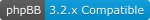

# **Usermap for phpBB**

 

### **Description**
Usermap is an extension for phpbb boards versions 3.2.x and 3.3.x which adds a map with your users locations - and if you choose so, an additional layer with
points of interest (POI) for your users - to the board. It is accessible through a link in the board's header.  
To determine your users' locations Usermap uses the country and the postal code of the municipality a user lives in and looks up its coordinates primarily in
the database of *[geonames.org][]* which means that it is **mandatory** for you to register an account there. Without this account Usermap will not function!  
Since *[geonames.org][]* does not provide coordinates for every country in the world you can select Google Maps as an additional source and for all countries
even Google Maps does not provide postal code related coordinates you as your board's administrator can provide coordinates for a pair of country and postal
code by filling a table of phpbb's database. For more information please refer to the hints in the `ACP Settings` tab of the extension which provides some
links to important pages of the above mentioned providers.  
The POIs (which could be anything from landmarks to bikers' hangouts to sports arenas or whatever is important to your board) are stored in a table of
phpbb's database which the administrator can fill within the ACP.  
For privacy protection Usermap is visible only to users who have provided their (valid) data and thus are displayed on the map. Basically this is true for
the POIs, too but you can select to display those for all users. This selection has no impact on the display of users' locations, these are still invisible
for unauthorized users.

### **Installation**
It is strongly recomended that you use the zipped file package for installation since it always provides the latest version: *[download link][]*  
After downloading unzip the file and upload it with a good ftp program (like FileZilla or WinSCP) to your board's `ext` folder where you should find this
directory structure:  
`/ext/mot/usermap`.  
In this subdirectory all subdirectories and files of the extension must be located.  
Logging into your board's ACP go to the `Customise` tab, find the `Usermap for phpbb` line and enable the extension. Afterwards you should see the
Usermap's four tabs under the `USER MAP` heading in the ACP's `Extensions` tab.

### **Usage**

#### *Users*
Users are effected by Usermap during registration, in the UCP and when they click the link to actually displaying the map itself. If you are asking yourself
now why users are effected during registration, it is quite simple: Usermap creates two new `Custom Profile Fields` which are by default displayed in the
registration process. The first one is a text field for input of the user's postal code and the second one is a dropdown field listing all countries of the
world for the user to easily select the country matching his or her location. If a user provides this data during registration Usermap will try to get a
coordinate from the enabled database(s) during the activation process and adds this user to the Usermap users table if it was successful.  
If a user chooses to not provide this information during registration he or she can do this anytime through the `Profile` tab in his or her UCP. As soon
as the user hits the enter key Usermap will try to get a coordinate as described above.  
PLEASE NOTE: Users must provide a valid pair of postal code and country, otherwise the lookup in the database will fail and the user is not listed in the
Usermap users table. Since only users listed in this table are displayed on the map with the coordinates provided by the database all others are assumed to
be unauthorized and will see an error message instead of the map!  
  
Clicking the Usermap link in the header bar will open the map itself, its display is divided in three parts:
1.  Search Form  
In this part the user will find his or her postal code prefixed by his/her country's two letter country code and a hyphen and followed by a dropdown field to
select a range in kilometers which determines the radius around that location in which Usermap will look for other users after the `Submit` button was hit. 
The result will be displayed in the next line(s) and if successful lists all users within the defined circle ordered by ascending distance. The user name
is written in this user main group's colour and is a link to this user's profile which will open in a new browser tab or window depending on the settings
of the browser.
2.  User Map  
This part displays the map itself. It contains two control elements, a scale control element in the upper left corner and a layer control element in the
upper right corner. The first one should be rather self-explanatory, the second one offers the possibility to switch between a road map (default) and a
topographical map and (if points of interest are enabled and the user is viewed as an authorized user with his or her location on the map) select buttons 
for the user and the POI overlay. The user overlay is displayed by default and users can add the POI overlay by ticking this field. Unauthorized users may
see the POI overlay by default if this is enabled by the administrator.  
User locations are displayed with circle markers coloured with the respective users main group color and POIs are displayed with a triangle standing on its
point, coloured as the administrator has chosen during input.  
If more than one user selected the same combination of country and postal code all markers at this position would be overlapping entirely with only one user
visible. To prevent this the locations of the second and all subsequent users with identical country/postal code combinations are calculated with a dynamic
offset to spread them around the original position.
3.  Legend  
In this part the user groups are listed with their respective colour and the total number of Usermap users is displayed as well as the POI legend if these
are enabled.

#### *Administrator*
Administrators will find the `User Map` section within the ACP's `Extensions` tab providing itself four tabs:
1.  Settings  
	Please read the descriptions within the sections of this tab carefully since they provide vital information to the individual settings.  
	+  Map Settings  
		to define latitude and longitude of the map's center when opening the Usermap window as well as the initial zoom (aka scale).  
	+  Username for geonames.org  
		should be self-explanatory; if no input was provided, the form keeps going back to this text field when hitting the `Submit` button. Please keep in
		mind that this setting MUST NOT be empty since geonames is the extensions primary means to get coordinates.  
		Usermap DOES NOT check the validity of the provided user name, this is wholly the administrator's responsibility!
	+  Settings for using Google Maps API  
		to provide the API key necessary for using this service. Please keep in mind that you need to activate this key for the `Geocoding API` to operate 
		properly.  
		If you enabled the Google Maps service without providing input in this text field the ACP will keep coming back to this field until you input a key.  
		As well as the input for the geonames user name this input is not checked for its validity!
	+  Using the internal database  
		The internal database (which has to be filled by the administrator, see serial 4. for further information) is kind of a last resort to gain coordinates
		for a given pair of country/postal code. You may want to use this possibility if only a few of your board's users live in countries not listed in the
		geonames database and you don't want to use the Google Maps API service.
	+  Display points of interest (POI)  
		Enabling the display of the POI overlay is done with this setting. In addition you can enable all of your users (even those who haven't provided
		their location for the map) to see the POI overlay.
	+  POI Legend  
		This setting is only displayed in case the POI overlay is enabled (see previous setting). You can enter a description of your POI's colour scheme or
		whatever you wish to say to your users about the POIs.
	
2.  Language packs  
	Usermap checks during installation the languages which are installed with your board and if there is a corresponding language pack in its language
	subdirectory it installs the necessary dropdown field for the country in this language. For all other languages this dropdown field is installed using
	the English language pack. If you later aquire an additional Usermap language pack or install an additional language (for which you have a Usermap
	language pack) you need to install this language to enable your users to see the country dropdown field in this language.  
	This is done through this tab. It shows three tables, the first one containing the Usermap language packs ready for installation, which is done by
	just clicking on the `Install` link in the last column.  
	The second table lists all languages which are installed in your board but are missing in the Usermap package and the third table lists for your
	convenience all Usermap language packs with no language installed in your board.
	
3.  Internal database  
	If you are in need of coordinates for a country unsupported by Geonames and Google Maps APIs you can build your own table to look up these locations.
	Usermap enters a new table into the database at its installation where you can store country and postal code of the location in question together
	with its coordinates. If a user selects this combination and you have enabled the use of the internal database in the settings tab Usermap will fetch
	the coordinates to store with this user's data from this table.  
	The content of the table containing all of your manually entered locations with their ISO two uppercase letter country code and postal code as well as
	the corresponding coordinates with latitude and longitude as decimal degrees (e.g. 52.589°) is displayed at this tab's top. In the options column you
	find a link to delete the selected entry in case you no longer need it.  
	Underneath that table you can input new locations. Each combination of country and postal code must be unique, entering an already existing combination
	a second time will result in an error message, this input will be rejected.
	
4.  POI handling
	A Point of Interest (POI) could be any landmark you wish to show to your users. Usermap stores them in a table entered into the database at instalarion.
	If you have enabled the display of POIs you need to enter the data somewhere, this is the place you are looking for.  
	As with the internal database this tab starts with a table displaying the current content of the database table. Every POI has a name which is displayed
	as a tool tip when the mouse pointer hovers over the icon, a decription which is displayed in a popup bubble when the user clicks the icon, an icon file
	which holds the icon with which the POI is marked on the map and a pair of coordinates.  
	Underneath this table you find a form to input new POIs or edit existing POIs. The input fields of this form are pretty selfexplanatory, please note
	that you can use bbcodes (including linking to external web sites) in the description text field.
  
Please note that a basic check is done when you input something in the form fields of the ACP, e.g. the coordinates need a dot as decimal separator but in
countries using a comma as separator it is easy to forget this, Usermap checks for a comma and automatically changes it into a dot. Usermap checks most inputs
respectively and either corrects the input or rejects it by deleting your input in this form field.

### **Requirements**

As mentioned above a (free) account with *[geonames.org][]* is mandatory and if you choose to use Google Maps as well you need to set up an account
with the *[Google Maps API][]* as well, links are provided within the `ACP Settings` tab of Usermap.  
In order to display member profiles and POI markers as intended it is crucial that the values `Server protocol`, `Domain name` and `Script path` (the last
one only if your board's root is within a subdirectory of the path your domain name points to) are properly set. If you experience any difficulties displaying
the POI markers or the member profiles through the postal code search please check the above mentioned values in the `ACP -> General -> Server Configuration`
tab.

[geonames.org]: http://www.geonames.org
[download link]: https://www.mike-on-tour.com/mot/mot_usermap.php
[Google Maps API]: https://developers.google.com/maps/documentation/javascript/get-api-key 
