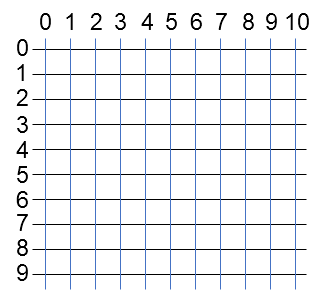
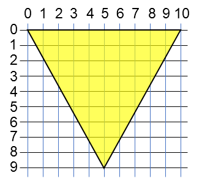

# Icons

## Definition
Icons are part of a kind of illustrations which are called graphics in the computer world; just think of "pictures". But there is one big difference between a graphic called picture and a graphic called
icon: Pictures transport information, icons represent something, mostly they stand as a simple representation to show you where you can find information.  
In the case of Usermap icons represent a location either for a member or a Point of Interest (POI), they just show you where you can find information. But - you say - they have different shapes and colours
and thus transport information. Yes, basically this is true, but they represent still just that small bit of information about what they really represent, e.g. a black round marker on the map represents a
registered member and a blue triangle represents some kind of landmark. Shape and colour of an icon represent therefore just different kinds of information.  
  
## Display on a computer screen
Computers display information on the screen through small dots which can have a colour and brilliance. These dots are arranged in lines and columns, e.g. a screen with 1280 x 1024 dots (which are called
pixel from picture element) has 1024 lines with 1280 columns which adds up to a total of a little bit over 1.3 million pixels. Remains the question how the computer "knows" where to display what information
by giving the dots individual colours and brightness. That is pretty easy, the lines and columns are numbered starting with Zero in the upper left corner. So the pixel in the upper left corner would have
the "address" (0, 0) and the one in the lower right corner (1279, 1023).  
The same system applies to graphics in general and icons in our special case. They are a - distinctly smaller - array of pixels. Let us define an icon which is 11 by 10 pixels big. It could be imagined as
dots on a system of "coordinates" with the coordinates looking like this:  
  
  
  
You can see that we start in the upper left corner with the coordinates (0, 0) and end in the lower right corner with (10, 9).

### Size
With this we have already defined the **size** of our icon, which is 11 by 10 pixels.  
Let us create a rather simple icon, a triangle standing on its tip:  
  
  
  
### Anchor
Let us imagine thet we have some computer code which includes the triangle we just created. As soon as this icon is detected the computers looks up its size (it is encoded in the graphics data representing
this icon) and starts to draw it at the address defined. Let us assume we told the computer to start displaying our icon at the screen address (639, 511) which is right in the screen's center then the computer
will display the icon's pixel at (0, 0) at this screen address. The icon's pixel at (1, 0) will be displayed at the screen address (640, 511) and so on. The first pixel of the second line of our icon will
be displayed at screen address (639, 512) and so on. The triangle's tip would be displayed at the screen coordinates (644, 520). Now let us assume that at our triangle is the representation of a POI which is
displayed at the screen coordinates (639, 511). One would expect that the icon's tip would point to that location but it doesn't!  
How do we solve that proplem? We saw that the computer started to draw the upper left corner of our icon at the screen position we told it to draw our icon because it assumed that it should start there
with the first pixel. So we have to tell the computer that we want it to draw the icon in a manner that the tip is displayed at screen coordinates (639, 511) und we do this by defining an **anchor**!  
In this case this anchor is at the icon's coordinates (5, 10) and by telling this anchor point to the computer it "knows" that it has to start drawing our icon at screen coordinates (634, 502) and we get
the desired result: Our triangle's tip is displayed at screen coordinates (639, 511). Task accomplished!  
If you want the upper right point of this triangle to point to the center coordinate of the computer screen what would be the correct anchor? If your answer is (10, 0) you have won the all expenses paid
bike ride through your neighborhood - and please don't forget your bicycle ;-)
  
### Usermap and Icon size
An icon's size is defined within its data so you are probably asking yourself why we define an icon's size in Usermap since this seems to be pretty superfluous. This is correct as long as you don't want
our triangle to be more prominent for one POI than for all the others on our map. If you tell the computer that this one special icon should be drawn in a size of 21 by 20 pixels it will just do that.  
But please keep in mind that this might look kind of funny if you use your own (pixel based) icons. Usermap comes with a collection of vector graphics icons which won't look distorted if their size is
changed.
And if you change the icon size what else do you have to keep in mind? Right, the anchor. If you still want the tip of your (now double the original size) triangle be displayed in the screen's
center you have to define the anchor as well and in this case it would be (10, 19) - but that doesn't come as a surprise, does it?
